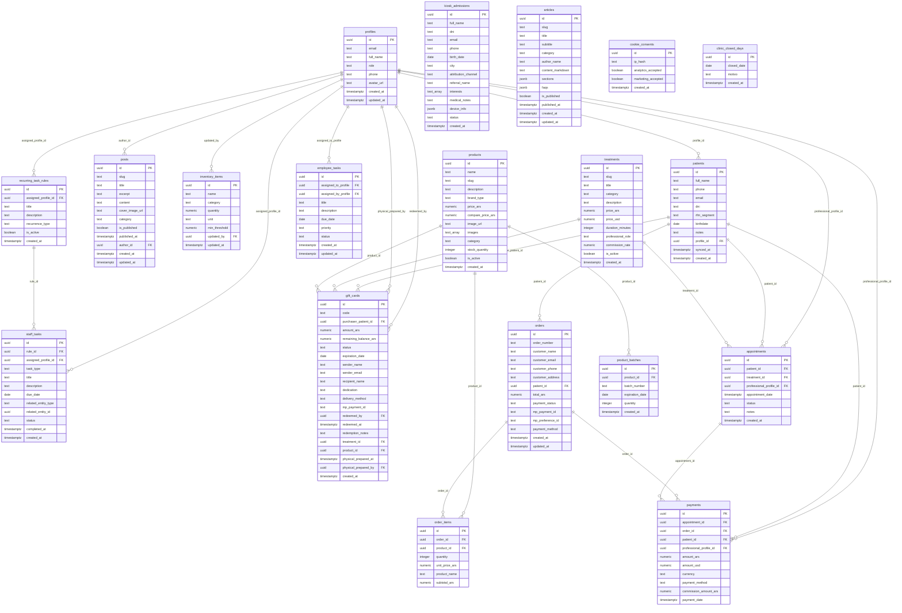
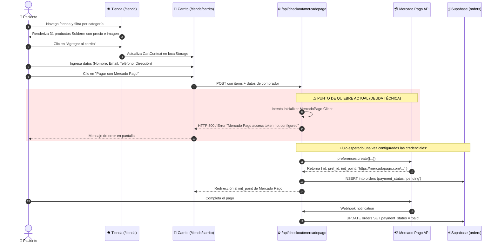
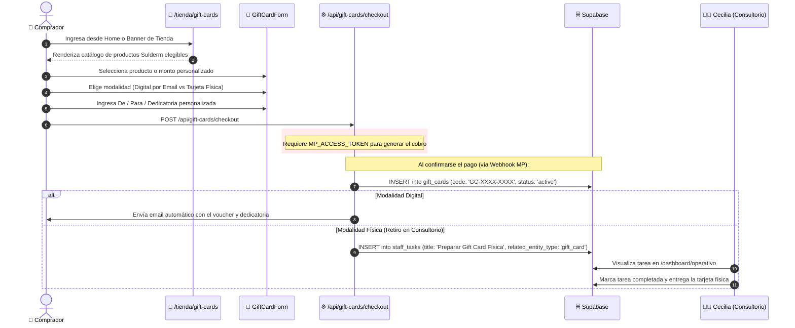
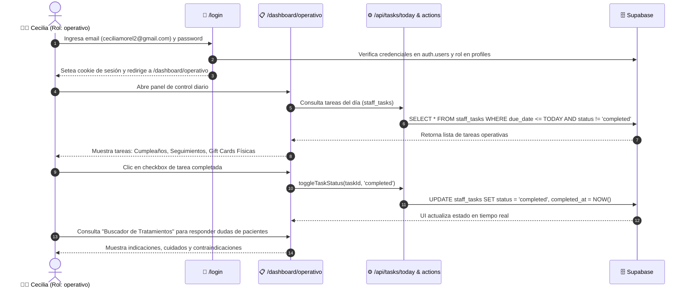
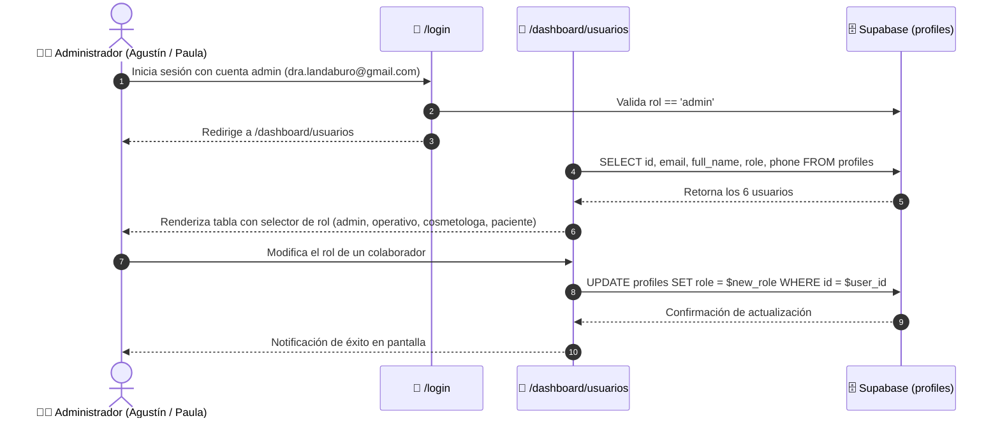

# Documentación Completa de Arquitectura — Dra. Landaburo (dralandaburo.com)

**Fecha de última auditoría:** 2 de Septiembre de 2026  
**Dominio de producción:** `https://www.dralandaburo.com` / `https://dralandaburo.com`  
**Hosting:** AWS EC2 Bitnami (`54.94.94.20`, sa-east-1, Instance ID: `i-0c3cb2b0ff16d224b`)  
**Base de Datos & Auth:** Supabase PostgreSQL (`mdletvbgwzbpenzevurr.supabase.co`)  
**Motor de Automatizaciones:** n8n Cloud (`arbol.app.n8n.cloud`)  

---

## PARTE 0 — Prerequisito: Diagnóstico y Resolución `employee_tasks` vs `staff_tasks`

### 1. Estado en el Código Fuente (Grep Real)
Se auditó todo el árbol de `/src` buscando referencias a ambas tablas:

```bash
# Evidencia: Búsqueda de tablas en el código fuente
$ Get-ChildItem -Path "src" -Recurse -Filter "*.ts*" | Select-String -Pattern "employee_tasks|staff_tasks"

src\app\api\tasks\today\route.ts:38:    .from('staff_tasks')
src\app\api\tasks\today\route.ts:82:    .from('staff_tasks')
src\app\api\webhook\mercadopago\route.ts:145: await supabase.from('staff_tasks').insert({
src\app\dashboard\operativo\actions.ts:26:   .from('staff_tasks')
src\app\dashboard\operativo\page.tsx:73:     .from('staff_tasks')
```

* **`/dashboard/operativo/page.tsx`**: Consulta exclusivamente `staff_tasks`.
* **`/dashboard/operativo/actions.ts`**: Actualiza el estado en `staff_tasks`.
* **`/api/tasks/today/route.ts`**: Lee y genera tareas del día en `staff_tasks`.
* **`/api/webhook/mercadopago/route.ts`**: Crea tareas físicas en `staff_tasks`.
* **`employee_tasks`**: Tiene **0 referencias activas** en la aplicación Next.js.

### 2. Estado en Base de Datos (Supabase)
```json
// Evidencia de conteo en Supabase (API REST con SERVICE_ROLE_KEY)
{
  "employee_tasks": { "filas": 0, "columnas": 10 },
  "staff_tasks":    { "filas": 0, "columnas": 12 }
}
```

### 3. Comparativa de Esquema y Recomendación Técnica
* **`employee_tasks`**: Esquema plano básico (`id, assigned_to_profile, assigned_by_profile, title, description, due_date, priority, status, created_at, updated_at`). No tiene soporte para tareas automáticas por reglas ni entidades relacionadas.
* **`staff_tasks`**: Esquema desacoplado (`id, rule_id, assigned_profile_id, task_type, title, description, due_date, related_entity_type, related_entity_id, status, completed_at, created_at`). Posee Foreign Key con `recurring_task_rules.id` y soporta asociación polimórfica a entidades (`gift_card`, `patient`, `order`).

> **Recomendación Técnica:** Mantener **`staff_tasks` como la tabla definitiva y canónica**. La tabla `employee_tasks` queda formalmente marcada como **deprecada / obsoleta** lista para ser eliminada (`DROP TABLE employee_tasks`) en la próxima migración de limpieza de base de datos.

---

## PARTE 1 — Inventario Técnico Real

### 1.1 Tablas de Supabase (Esquema `public`)
Query real sobre la API de PostgREST / OpenAPI de Supabase con `SELECT COUNT(*)` exacto:

| # | Tabla | Filas Reales | Columnas | Claves Foráneas (FK) Confirmadas |
|---|---|---|---|---|
| 1 | `patients` | **306** | 11 | `profile_id -> profiles.id` |
| 2 | `products` | **31** | 13 | *(Ninguna)* |
| 3 | `profiles` | **6** | 8 | *(Ninguna — extiende `auth.users`)* |
| 4 | `kiosk_admissions` | **1** | 14 | *(Ninguna)* |
| 5 | `treatments` | **0** | 12 | *(Ninguna)* |
| 6 | `gift_cards` | **0** | 21 | `purchaser_patient_id -> patients.id`<br>`redeemed_by -> profiles.id`<br>`treatment_id -> treatments.id`<br>`product_id -> products.id`<br>`physical_prepared_by -> profiles.id` |
| 7 | `orders` | **0** | 17 | `patient_id -> patients.id` |
| 8 | `order_items` | **0** | 7 | `order_id -> orders.id`<br>`product_id -> products.id` |
| 9 | `payments` | **0** | 11 | `appointment_id -> appointments.id`<br>`order_id -> orders.id`<br>`patient_id -> patients.id`<br>`professional_profile_id -> profiles.id` |
| 10 | `appointments` | **0** | 8 | `patient_id -> patients.id`<br>`treatment_id -> treatments.id`<br>`professional_profile_id -> profiles.id` |
| 11 | `staff_tasks` | **0** | 12 | `rule_id -> recurring_task_rules.id`<br>`assigned_profile_id -> profiles.id` |
| 12 | `employee_tasks` | **0** | 10 | `assigned_to_profile -> profiles.id`<br>`assigned_by_profile -> profiles.id` *(Deprecada)* |
| 13 | `recurring_task_rules`| **0** | 7 | `assigned_profile_id -> profiles.id` |
| 14 | `product_batches` | **0** | 6 | `product_id -> products.id` |
| 15 | `articles` | **0** | 22 | *(Ninguna)* |
| 16 | `posts` | **0** | 12 | `author_id -> profiles.id` |
| 17 | `inventory_items` | **0** | 8 | `updated_by -> profiles.id` |
| 18 | `cookie_consents` | **0** | 5 | *(Ninguna)* |
| 19 | `clinic_closed_days` | **0** | 4 | *(Ninguna)* |

#### Detalle de los 6 Usuarios Registrados en `profiles`:
```
┌────────────────────────────────┬─────────────────────────────┬───────────────┐
│ Email                          │ Nombre Completo             │ Rol           │
├────────────────────────────────┼─────────────────────────────┼───────────────┤
│ agustinlandaburo@gmail.com     │ Agustin Roberto Landaburo   │ admin         │
│ dra.landaburo@gmail.com        │ Paula Natalia Landaburo     │ admin         │
│ ceciliamorel2@gmail.com        │ Cecilia Morel               │ operativo     │
│ lauradzuryk@gmail.com          │ maria laura dzuryk          │ operativo     │
│ mechipasquet.95@gmail.com      │ Mercedes Pasquet            │ cosmetologa   │
│ agustinlandaburo@hotmail.com   │ Agustin Landaburo           │ paciente      │
└────────────────────────────────┴─────────────────────────────┴───────────────┘
```

---

### 1.2 Rutas del Sitio (Next.js 16 App Router)
Resultado de auditoría en vivo con peticiones HTTP reales al servidor en producción:

| Ruta | Método | Tipo | HTTP Status | Comportamiento Verificado |
|---|---|---|---|---|
| `/` | `GET` | Página Pública | `200 OK` | Renderiza Home, Hero, Categorías, Bio, Testimonios, CTA Gift Cards |
| `/tratamientos` | `GET` | Página Pública | `200 OK` | Renderiza catálogo de tratamientos |
| `/tratamientos/[slug]` | `GET` | Página Pública | `200 OK` | Renderiza detalle (ej. `/tratamientos/toxina-botulinica`) |
| `/tienda` | `GET` | Página Pública | `200 OK` | Renderiza 31 cremas Sulderm, filtros dinámicos y banner Gift Cards |
| `/tienda/[slug]` | `GET` | Página Pública | `200 OK` | Renderiza detalle de producto (ej. `/tienda/agua-micelar-3-en-1`) |
| `/tienda/carrito` | `GET` | Página Pública | `200 OK` | Carrito con estado cliente (Context) |
| `/tienda/gift-cards` | `GET` | Página Pública | `200 OK` | Configurador de Gift Cards con selector de productos Sulderm |
| `/tienda/pago/exito` | `GET` | Página Pública | `200 OK` | Página de confirmación post-checkout |
| `/tienda/pago/fallo` | `GET` | Página Pública | `200 OK` | Página de error en pago |
| `/tienda/pago/pendiente`| `GET` | Página Pública | `200 OK` | Página de pago pendiente |
| `/blog` | `GET` | Página Pública | `200 OK` | Blog y artículos |
| `/contacto` | `GET` | Página Pública | `200 OK` | Formulario de contacto y datos de consultorio |
| `/sobre-mi` | `GET` | Página Pública | `200 OK` | Perfil y filosofía médica de la Dra. Landaburo |
| `/consentimientos` | `GET` | Página Pública | `200 OK` | Información y consentimientos informados |
| `/kiosco` | `GET` | Página Pública | `200 OK` | Formulario de autoadmisión para tablet en sala de espera |
| `/login` | `GET` | Página Pública | `200 OK` | Login con Supabase Auth |
| `/registro` | `GET` | Página Pública | `200 OK` | Registro de nuevos usuarios |
| `/portal/paciente` | `GET` | Protegida (Auth) | `307 Redirect`| Redirige a `/login?redirectTo=/portal/paciente` |
| `/dashboard/ejecutivo` | `GET` | Protegida (Auth) | `307 Redirect`| Redirige a `/login?redirectTo=/dashboard/ejecutivo` |
| `/dashboard/operativo` | `GET` | Protegida (Auth) | `307 Redirect`| Redirige a `/login?redirectTo=/dashboard/operativo` |
| `/dashboard/operativo/gift-cards` | `GET` | Protegida (Auth) | `307 Redirect`| Redirige a `/login?redirectTo=/dashboard/operativo/gift-cards` |
| `/dashboard/productos` | `GET` | Protegida (Auth) | `307 Redirect`| Redirige a `/login?redirectTo=/dashboard/productos` |
| `/dashboard/usuarios` | `GET` | Protegida (Auth) | `307 Redirect`| Redirige a `/login?redirectTo=/dashboard/usuarios` |
| `/dashboard/blog` | `GET` | Protegida (Auth) | `307 Redirect`| Redirige a `/login?redirectTo=/dashboard/blog` |
| `/dashboard/blog/nuevo` | `GET` | Protegida (Auth) | `307 Redirect`| Redirige a `/login?redirectTo=/dashboard/blog/nuevo` |
| `/api/tasks/today` | `GET` | API Route | `401 Unauthorized` | Requiere sesión activa |
| `/api/admin/fix-trigger` | `GET` | API Route | `401 Unauthorized` | Endpoint administrativo |
| `/api/contacto` | `POST` | API Route | `400/500` | Procesa envío de formulario de contacto |
| `/api/checkout/mercadopago` | `POST` | API Route | `400 Bad Request` | Endpoint de creación de preferencia de pago |
| `/api/gift-cards/checkout` | `POST` | API Route | `400 Bad Request` | Endpoint de compra de Gift Cards |
| `/api/gift-cards/lookup` | `POST` | API Route | `400/405` | Consulta de código de Gift Card |
| `/api/gift-cards/redeem` | `POST` | API Route | `401 Unauthorized` | Canje de Gift Card (solo rol operativo/admin) |
| `/api/kiosco/admision` | `POST` | API Route | `200/500` | Inserción de admisión en `kiosk_admissions` |
| `/api/webhook/mercadopago`| `POST` | API Route | `400/200` | Webhook de confirmación de pago |
| `/api/blog/ingest` | `POST` | API Route | `401 Unauthorized` | Ingesta de artículos vía secret token |

---

### 1.3 Workflows de n8n (Instancia Cloud `arbol.app.n8n.cloud`)
Consultado directamente vía n8n API:

| ID | Nombre | Estado (`active`) | Nodos | Función |
|---|---|---|---|---|
| `pW8F2GHYnWLoAU75` | **WF-02 Patient Sync — Supabase** | ✅ `true` | 12 | Sincronización de Base Unificada (Drive / Cron 8 AM / Webhook) con upsert a `patients` |
| `JjKayRucnzy1mjzv` | **WF-01 Calu Sync** | ✅ `true` | 7 | Pipeline de extracción de agendas y turnos de Calu |
| `oqNSSRYlMy3ytERX` | **WF-06 Lead Intelligence** | ✅ `true` | 14 | Enriquecimiento y categorización de consultas entrantes |
| `PNrNHtmPMpwTh6sr` | **WF-04 Birthday — Saludos Automáticos** | ❌ `false` | 8 | Saludos de cumpleaños automáticos por WhatsApp (inactivo por falta de WABA) |
| `4rS60VfG1wqpi1O7` | **WF-07 Alertas Operativas** | ❌ `false` | 7 | Alertas de stock y recordatorios internos |
| `GJugNNL2C1ks2BmB` | **WF-03 Campaign Generator** | ❌ `false` | 14 | Generador de campañas de recontacto |
| `RBoSi3G74KwzHJAt` | **WF-06 Lead Verification** | ❌ `false` | 2 | Verificación rápida de teléfonos |

---

### 1.4 Variables de Entorno e Integraciones Externas

```
┌──────────────────────────────┬─────────────────────────┬────────────────────────────────────────────────────────┐
│ Servicio / Integración       │ Variable / Recurso      │ Estado Real de Configuración                           │
├──────────────────────────────┼─────────────────────────┼────────────────────────────────────────────────────────┤
│ Supabase DB & Auth           │ NEXT_PUBLIC_SUPABASE_URL│ ✅ ACTIVO (mdletvbgwzbpenzevurr.supabase.co)            │
│ Supabase Service Role        │ SUPABASE_SERVICE_ROLE_KEY│ ✅ ACTIVO                                              │
│ Blog Sync Secret             │ BLOG_SYNC_SECRET        │ ✅ ACTIVO (dl-blog-sync-secret-2026)                   │
│ Mercado Pago Checkout        │ MP_ACCESS_TOKEN         │ ❌ PENDIENTE (No configurado en .env ni app_settings)  │
│ Mercado Pago Webhook         │ MP_WEBHOOK_SECRET       │ ❌ PENDIENTE                                           │
│ WhatsApp Business API        │ WHATSAPP_API_TOKEN      │ ❌ PENDIENTE (Solo link directo wa.me en frontend)     │
│ Google Drive OAuth (n8n)     │ OAuth2 Credentials      │ ✅ ACTIVO en n8n Cloud (WF-02)                          │
│ Certificado SSL              │ Let's Encrypt           │ ✅ ACTIVO (Válido dralandaburo.com / www hasta Nov 26)  │
└──────────────────────────────┴─────────────────────────┴────────────────────────────────────────────────────────┘
```

---

## PARTE 2 — Diagrama de Arquitectura General

```mermaid
flowchart TB
    subgraph CLIENTS["🌐 Capa de Clientes & Navegación"]
        Browser["💻 Navegador Web (Desktop / Mobile)"]
        Tablet["📱 Tablet Consultorio (Modo Kiosco /kiosco)"]
        WhatsAppUser["💬 Paciente vía WhatsApp (wa.me)"]
    end

    subgraph HOSTING["☁️ AWS EC2 (54.94.94.20 - sa-east-1)"]
        Apache["🛡️ Apache 2.4 (Reverse Proxy + Let's Encrypt SSL)"]
        
        subgraph NEXTJS["⚡ Next.js 16 (App Router + Turbopack) [Port 3000 - PM2]"]
            subgraph PUBLIC_ROUTES["Páginas Públicas"]
                Home["/ (Home + Gift Cards CTA)"]
                Tratamientos["/tratamientos & /[slug]"]
                Tienda["/tienda & /[slug] (31 Sulderm)"]
                GiftCardsFront["/tienda/gift-cards"]
                Kiosco["/kiosco"]
                AuthPages["/login & /registro"]
            end

            subgraph PROTECTED_ROUTES["Dashboards (Auth Guard - 307 Redirect)"]
                DashEjecutivo["/dashboard/ejecutivo (Admin)"]
                DashOperativo["/dashboard/operativo (Ceci)"]
                DashGiftCards["/dashboard/operativo/gift-cards"]
                DashUsuarios["/dashboard/usuarios (Admin)"]
                PortalPaciente["/portal/paciente"]
            end

            subgraph API_ROUTES["API Endpoints"]
                APIKiosco["/api/kiosco/admision"]
                APITasks["/api/tasks/today"]
                APIGiftLookup["/api/gift-cards/lookup"]
                APIGiftRedeem["/api/gift-cards/redeem"]
                APIMPCheckout["/api/checkout/mercadopago [Sin Config]"]
                APIMPWebhook["/api/webhook/mercadopago"]
            end
        end
    end

    subgraph SUPABASE["🗄️ Supabase Cloud (PostgreSQL 15 + GoTrue Auth)"]
        AuthModule["🔐 Supabase Auth (JWT + Cookies)"]
        DB_Patients[("patients (306 filas)")]
        DB_Products[("products (31 Sulderm)")]
        DB_Profiles[("profiles (6 usuarios)")]
        DB_StaffTasks[("staff_tasks (0 filas)")]
        DB_GiftCards[("gift_cards (0 filas)")]
        DB_Kiosk[("kiosk_admissions (1 fila)")]
        DB_Orders[("orders & order_items")]
    end

    subgraph AUTOMATIONS["🤖 n8n Cloud (arbol.app.n8n.cloud)"]
        WF02["WF-02 Patient Sync (ACTIVO)\nGoogle Drive -> Supabase patients"]
        WF01["WF-01 Calu Sync (ACTIVO)"]
        WF06["WF-06 Lead Intelligence (ACTIVO)"]
        WF04["WF-04 Birthday (INACTIVO - Sin WABA)"]
    end

    subgraph EXTERNAL["🔌 Servicios Externos"]
        GDrive["📁 Google Drive (Planilla Pacientes)"]
        MP_API["💳 Mercado Pago API (PENDIENTE DE CREDENCIALES)"]
        WABA["📲 WhatsApp Business Cloud API (PENDIENTE)"]
    end

    %% Conexiones Clientes
    Browser -->|HTTPS 443| Apache
    Tablet -->|HTTPS 443 /kiosco| Apache
    WhatsAppUser -->|wa.me Link| WABA

    %% Conexiones Apache
    Apache -->|ProxyPass http://127.0.0.1:3000| NEXTJS

    %% Conexiones Next.js a Supabase
    PUBLIC_ROUTES -->|REST / PostgREST| SUPABASE
    PROTECTED_ROUTES -->|SSR createClient() + Auth Check| AuthModule
    PROTECTED_ROUTES -->|Queries| SUPABASE
    API_ROUTES -->|Service Role Client| SUPABASE

    %% Conexiones n8n
    GDrive -->|Polling 15 min / Webhook| WF02
    WF02 -->|Batch Upsert on_conflict=phone| DB_Patients
    WF04 -.->|Blocked| WABA

    %% Conexiones Pasarelas
    APIMPCheckout -.->|Falla: Sin Access Token| MP_API
    MP_API -.->|Webhook POST| APIMPWebhook
```

---

## PARTE 3 — DER (Diagrama Entidad-Relación)

Todas las claves primarias (PK) y claves foráneas (FK) corresponden a las restricciones reales validadas en la base de datos:



---

## PARTE 4 — User Journeys

### 4.1 Paciente Comprando un Producto en la Tienda


---

### 4.2 Paciente Comprando una Gift Card


---

### 4.3 Cecilia usando el Dashboard Operativo en su Día a Día


---

### 4.4 Administrador Gestionando Roles y Usuarios


---

## PARTE 5 — Estado y Deuda Técnica

Matriz de estado verificada empíricamente contra la infraestructura activa:

```
┌────────────────────────────────────────────────────────┬───────────────────┬────────────────────────────────────────────────────────┐
│ Componente / Módulo                                    │ Estado            │ Detalle y Evidencia Real                               │
├────────────────────────────────────────────────────────┼───────────────────┼────────────────────────────────────────────────────────┤
│ Dominio Público & Certificado SSL                      │ ✅ COMPLETO       │ dralandaburo.com / www sirviendo Next.js (Let's Encrypt)│
│ Catálogo Sulderm en Tienda                             │ ✅ COMPLETO       │ 31 productos reales en Supabase con precios e imágenes │
│ Redirecciones 301 URLs WordPress                       │ ✅ COMPLETO       │ next.config.ts redirige posts con fecha a tratamientos │
│ Autenticación & Control de Acceso por Roles            │ ✅ COMPLETO       │ 307 Redirect en dashboards, 6 perfiles categorizados   │
│ Kiosco de Admisión en Consultorio (/kiosco)            │ ✅ COMPLETO       │ Formulario de sala de espera guardando en DB           │
│ Configuración de Mercado Pago                          │ ⚠️ CONSTRUIDO     │ Código listo (/api/checkout), falta Access Token y Webhook│
│ WhatsApp Business API                                  │ ⚠️ PARCIAL        │ Botón wa.me activo; falta WABA Cloud API para auto-msgs│
│ Sincronización de Pacientes Base Unificada (n8n WF-02) │ ⚠️ ACTIVO / AUDIT │ WF-02 activo (306 pacientes), parser normalizado       │
│ Tabla de Tratamientos en Supabase                      │ ⚠️ PENDIENTE      │ treatments tiene 0 filas; catálogo está en treatments.ts│
│ Depuración de Tabla Antigua employee_tasks             │ ⚠️ PENDIENTE      │ staff_tasks es la activa; employee_tasks lista para drop│
└────────────────────────────────────────────────────────┴───────────────────┴────────────────────────────────────────────────────────┘
```
