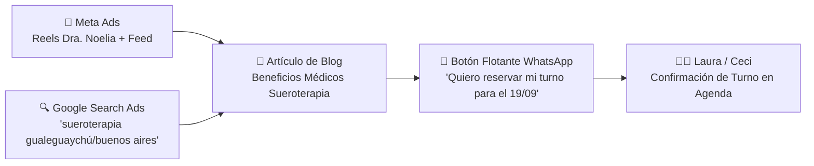
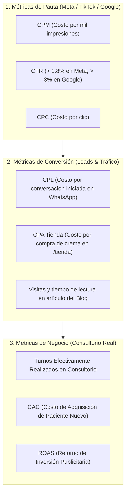

# 🚀 Plan Integral de Campañas, Contenido & Crecimiento — Dra. Landaburo

**Período:** Septiembre – Diciembre 2026  
**Objetivo General:** Maximizar la captación de pacientes calificados, posicionar nuevos tratamientos médicos de vanguardia (Sueroterapia, Sunekos, Frax Lips, Corporales) y escalar las ventas del e-commerce de cremas Sulderm.

---

## 📊 Matriz Resumen de Campañas & Prioridades

| Campaña | Tratamiento / Foco | Público Objetivo | Canal Principal | Objetivo de Conversión | Fecha / Timing |
|---|---|---|---|---|---|
| **C-01: Lanzamiento** | **Sueroterapia (Vit. C)** | Hombres y mujeres 30-65 años (bienestar, defensas, energía) | Meta Ads + Google Ads + Blog | Turnos para jornada del 19/09 | **Inmediato (04 al 18/09)** |
| **C-02: Regeneración** | **Sunekos & Sunekos + Frax** | Pacientes 35-65 años (arrugas finas, ojeras, calidad de piel) | Meta Ads (Instagram Reels) | Consultas médicas a WhatsApp | **Septiembre – Octubre** |
| **C-03: Eventos & Glow** | **Frax Lips + Meso Francesa** | Chicas 16-24 años (colaciones, egresadas, fiestas fin de año) | **TikTok Ads** + Reels | Clic a WhatsApp / Turno Express | **Octubre – Diciembre** |
| **C-04: Skincare Shop** | **Cremas Sulderm** | Pacientes actuales y compradores de dermocosmética | Meta Ads (Catálogo) + Email/WA | Compras directas en `/tienda` | **Continuo** |
| **C-05: Protocolos Cuerpo** | **HIFU + Enzimas + Fosfatidilcolina** | Mujeres y hombres 28-60 años (adiposidad, celulitis, firmeza) | Meta Ads + Search Ads | Evaluaciones corporales presenciales | **Septiembre – Diciembre** |

---

## 🔬 CAMPAÑA 1: Lanzamiento Exclusivo de Sueroterapia (19 de Septiembre)
> **Directora del protocolo:** Dra. Noelia Luque (Especialista en Clínica Médica, Cuidados Críticos y Sueroterapia).



### 1.1 Objetivos & KPIs
* **Objetivo Primario:** Llenar los cupos disponibles para la **primera jornada del Sábado 19/09**.
* **KPIs de Éxito:**
  * Cantidad de pacientes confirmados para la jornada (Meta sugerida: 8 a 12 pacientes).
  * Costo por Conversación Iniciada en WhatsApp (Meta: < $3.500 ARS).
  * Tasa de asistencia a la sesión (> 90%).

### 1.2 Estructura del Artículo del Blog (`/blog/sueroterapia-bienestar-celular`)
* **Título H1:** *Sueroterapia: El poder de los nutrientes endovenosos para revitalizar tu cuerpo y tu piel desde adentro.*
* **Puntos Clave del Contenido:**
  1. *¿Qué es la terapia de infusión endovenosa (IV Drip Therapy)?* Biodisponibilidad del 100% frente a la suplementación oral.
  2. *El rol de la Vitamina C en altas dosis:* Antioxidante maestro, síntesis de colágeno, refuerzo inmunológico y energía mitocondrial.
  3. *¿Para quién está indicado?* Fatiga crónica, estrés, piel opaca, preparación dérmica previa a procedimientos estéticos, pos-enfermedad.
  4. *Supervisión médica:* Respaldo de la Dra. Noelia Luque y protocolo clínico seguro.
  5. *CTA al pie:* Banner destacado para reservar lugar en la jornada del 19/09.

### 1.3 Pauta en Google Ads & Meta Ads
* **Google Ads (Búsqueda):** Palabras clave exactas: `"sueroterapia"`, `"sueros de vitamina c"`, `"terapia intravenosa gualeguaychú"`, `"sueros bienestar palermo"`.
* **Meta Ads (Públicos):**
  * *Público 1 (Caliente):* Pacientes actuales del consultorio (Custom Audience de base de datos) + Interacciones de Instagram en los últimos 90 días.
  * *Público 2 (Frío/Intereses):* Hombres y mujeres 30-60 años con interés en bienestar, medicina preventiva, nutrición funcional, dermatología, crossfit, yoga, longevidad.

---

## ✨ CAMPAÑA 2: Sunekos & Sunekos + Frax 1550 (Regeneración de Matriz Extracelular)

### 2.1 Concepto Médico y Diferenciador
* **Sunekos:** Fórmula patentada de ácido hialurónico no reticulado + 6 aminoácidos esenciales (glicina, prolina, lisina, etc.) que estimula la elastina y colágeno tipo IV sin rellenar ni alterar volúmenes.
* **Sunekos + Frax (Nordlys):** La combinación reina. El láser fraccionado no ablativo Frax genera micro-columnas térmicas que disparan la cicatrización, mientras que Sunekos nutre profundamente la matriz dérmica para una recuperación acelerada y máxima luminosidad.

### 2.2 Estrategia Creativa en Meta Ads
* **Formato 1 — Video Educativo de la Dra. Paula:**
  * *Hook (0-3s):* *"¿Sentís la piel deshidratada o con arruguitas finas debajo de los ojos pero no querés rellenos que te cambien los rasgos?"*
  * *Cuerpo:* Explicación de la bio-regeneración dérmica y cómo actúa en ojeras y rostro.
  * *CTA:* *"Escribinos para una evaluación personalizada."*
* **Formato 2 — Carrusel Comparativo:**
  * Slide 1: Sunekos vs Rellenos tradicionales: ¿En qué se diferencian?
  * Slide 2: El combo definitivo: Sunekos + Tecnología Láser Frax.
  * Slide 3: Zonas clave (ojeras, cuello, escote, contorno peribucal).
* **Métrica de Éxito:** CTR > 2.5%, Costo por consulta calificada a WhatsApp.

---

## 💋 CAMPAÑA 3: "Frax Lips" & "Frax Lips + Meso Francesa" (Especial Colaciones & Fin de Año)

### 3.1 Tratamiento & Propuesta de Valor
* **Frax Lips:** Procedimiento no invasivo con láser fraccionado en labios que estimula la microcirculación y regeneración dérmica, aportando volumen suave y color rosado natural por 7 a 10 días.
* **Frax Lips + Meso Francesa (NCTF 135 HA):** Hidratación biológica profunda con efecto "gloss permanente" sin necesidad de ácido hialurónico inyectable reticulado. Ideal para eventos puntuales.

### 3.2 Estrategia Novedosa en TikTok Ads & Reels
* **Público Objetivo:** Mujeres jóvenes de 16 a 24 años (Egresadas secundarias, universitarias, fiestas de fin de año, colaciones) + Madres de egresadas.
* **Tono del Contenido:** Fresco, dinámico, estético, estilo *Get Ready With Me (GRWM)* y *Clean Girl Aesthetic*.

```
┌────────────────────────────────────────────────────────────────────────────────────────┐
│ 🎬 ESTRUCTURA DE GUION PARA TIKTOK / REEL                                             │
├────────────────────────────────────────────────────────────────────────────────────────┤
│ 0:00 - 0:03 | [Visual: Primer plano de labios con glow natural]                         │
│             | "El secreto médico para tener labios con volumen y glow en tu colación   │
│             | sin usar agujas ni rellenos permanentes."                                │
│ 0:03 - 0:10 | [Visual: Clips del procedimiento Frax y Meso Francesa en consultorio]   │
│             | "Se llama Frax Lips + Meso Francesa: hidrata, resalta el tono natural y  │
│             | dura perfecto para el fin de semana de tu fiesta."                       │
│ 0:10 - 0:15 | [Visual: Dra. Paula / Consultorio elegante]                              │
│             | "Coordiná tu sesión con tus amigas antes de que se llenen las fechas."   │
└────────────────────────────────────────────────────────────────────────────────────────┘
```

* **Cómo lanzar en TikTok Ads:**
  * Campaña con objetivo **Tráfico / Generación de Clientes Potenciales** geolocalizada en Entre Ríos y Buenos Aires.
  * Presupuesto diario inicial moderado ($5.000 a $8.000 ARS/día).
  * Destino: Enlace directo a WhatsApp con mensaje precargado: *"¡Hola! Vi el video de Frax Lips en TikTok y quiero consultar disponibilidad para mi fiesta de egresados."*

---

## 🧴 CAMPAÑA 4: E-Commerce de Cremas Sulderm (`/tienda`)

### 4.1 Enfoque de Pauta & Retargeting
* **Público Frío:** Campañas de Catálogo en Meta Ads segmentadas por rutinas:
  * *Rutina Anti-Manchas:* Serum NM + Ácido Glicólico LG + Protector Solar.
  * *Rutina Glow & Firmeza:* Hyaluronic Filler HA + Redensity Colágeno + Hydra Filler.
  * *Kit Anti-Celulitis ($85.000):* Crema reafirmante + Masajeador dérmico.
* **Público Caliente (Pacientes del Consultorio):**
  * Campañas de Re-engagement: *"Mantené los resultados de tu tratamiento médico en casa con tu rutina Sulderm."*
  * Enlace directo a la tienda web con envío a todo el país.

---

## 🏋️ CAMPAÑA 5: Protocolos Corporales de Alta Precisión (Primavera-Verano)

### 5.1 Combinaciones Terapéuticas
1. **Adiposidad Localizada:** HIFU Corporal + Fosfatidilcolina / Enzimas Recombinantes PBSerum (Lipasa).
2. **Celulitis & Flacidez:** HIFU + Mesoterapia Reafirmante / PBSerum (Hialuronidasa + Colagenasa).
3. **Calidad de Piel & Estrías:** Láser Frax 1550 + Sunekos Corporal.

### 5.2 Estructura del Embudo Publicitario
* **Creativo:** Foto o video editorial enfocado en zonas clave (abdomen, flancos, glúteos, pantalón de montar, brazos) con copy que resalte la evaluación médica personalizada previa.
* **Destino:** Consulta de diagnóstico corporal para armar el plan de sesiones a medida.

---

## 📈 Dashboard de Métricas, KPIs y Medición de Resultados

Para saber con certeza matemática si las campañas son rentables, configuraremos el seguimiento en 3 niveles:



### Tabla de Medición Semanal
1. **Gasto Total en Pauta ($ ARS)**
2. **Conversaciones de WhatsApp Recibidas** (etiquetadas por campaña: `#sueroterapia`, `#sunekos`, `#fraxlips`, `#corporal`)
3. **Turnos Agendados y Cobrados**
4. **Ventas en la Tienda Online (`/tienda`)**
5. **Retorno:** Si invertimos \$100.000 ARS en Sueroterapia y se agendan 4 pacientes a \$60.000 ARS c/u = Facturación \$240.000 ARS (**ROAS = 2.4x**).

---

## 🗓️ Cronograma de Ejecución Sugerido

```
Semana 1 (04/09 al 10/09):
├── Redacción y publicación del artículo de Sueroterapia en el Blog
├── Configuración de campaña Meta Ads y Google Search para el evento del 19/09
└── Activación de campaña de cremas Sulderm en /tienda

Semana 2 (11/09 al 18/09):
├── Intensificación de pauta de Sueroterapia (cierre de turnos para el 19/09)
├── Creación de creativos de Sunekos & Sunekos + Frax (Reels con Paula)
└── Filmación del primer contenido de Frax Lips para TikTok / Reels

Semana 3 (19/09 al 26/09):
├── Jornada de Sueroterapia (Registro de casos y fotos/videos para futuras fechas)
├── Lanzamiento oficial de campaña Sunekos + Frax
└── Lanzamiento de campaña Frax Lips en TikTok Ads para colaciones

Semana 4 (Octubre en adelante):
├── Lanzamiento de Campaña de Protocolos Corporales (Primavera-Verano)
└── Optimización semanal de presupuestos según costo por turno confirmado
```
