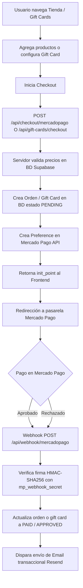

# Pagos, Comercio Electrónico y Gift Cards

Estado de Verificación: [VERIFICADO]
Fecha de Auditoría: 2026-09-14
Pasarela de Pago: Mercado Pago Argentina (Checkout Pro / Preferencias)
Moneda: Pesos Argentinos (ARS)

---

## 1. Arquitectura de Comercio Electrónico

El subsistema de comercio de `dralandaburo.com` cubre dos flujos transaccionales principales:
1. **Tienda de Productos Físicos (Skincare Sulderm):** Carrito client-side con validación de stock y precios en servidor.
2. **Gift Cards Digitales y Físicas:** Experiencia de regalo personalizada restringida a Cosmiatría (Mercedes Pasquet), productos seleccionados o monto libre.



---

## 2. Flujo de Checkout de Productos (Tienda)

### 2.1. Gestión de Carrito
- **Almacenamiento:** `localStorage` mediante el contexto `CartContext.tsx` (`dl_cart_v1`).
- **Estructura del Carrito:**
```typescript
interface CartItem {
  id: string; // UUID del producto
  name: string;
  price_ars: number;
  quantity: number;
  image_url: string;
  category: string;
}
```

### 2.2. Endpoint de Creación de Preferencia (`POST /api/checkout/mercadopago`)
- **Regla Crítica de Seguridad [VERIFICADO]:** El backend **NUNCA confía en los precios enviados por el cliente**.
- El endpoint recibe únicamente `{ items: [{ id, quantity }], customer: { name, email, phone, address, notes } }`.
- Consulta la tabla `products` en Supabase para obtener el `price_ars` real y calcula el subtotal.
- Inserta una fila en la tabla `orders` con `status: 'pending'` y `payment_status: 'pending'`.
- Inserta los registros correspondientes en `order_items`.
- Llama a `https://api.mercadopago.com/checkout/preferences` con:
  - `external_reference: order.id`
  - `notification_url: https://dralandaburo.com/api/webhook/mercadopago`
  - `back_urls`: `success: /tienda/pago/exito`, `failure: /tienda/pago/fallo`, `pending: /tienda/pago/pendiente`.
  - `auto_return: "approved"`.

---

## 3. Subsistema de Gift Cards

### 3.1. Reglas de Negocio [VERIFICADO]
1. **Alcance Exclusivo:** Solo se pueden emitir para tratamientos de **Cosmiatría Integral** (Mercedes "Mechi" Pasquet), productos de skincare o un monto en dinero ARS abierto. No aplican a procedimientos médicos invasivos exclusivos de la Dra. Landaburo (p. ej. toxina botulínica o rellenos).
2. **Vigencia:** 90 días corridos a partir de la fecha de acreditación del pago.
3. **Formato de Código:** `DL-XXXX-XXXX` (alfanumérico en mayúsculas generado en backend con entropía criptográfica).
4. **Modalidades de Entrega:**
   - `digital`: Envío inmediato por email al destinatario o al comprador para reenviar con mensaje personalizado.
   - `fisica`: Packaging premium para retiro en consultorio (Leandro N. Alem 45, Gualeguaychú).

### 3.2. Endpoint de Emisión (`POST /api/gift-cards/checkout`)
- Recibe configuración del regalo (`recipient_name`, `recipient_email`, `sender_name`, `message`, `delivery_method`, `items_selected`, `custom_amount_ars`).
- Valida los importes contra Supabase y calcula el total.
- Inserta en `gift_cards` con `payment_status: 'pending'`, `status: 'pending_payment'`.
- Crea la preferencia en Mercado Pago con `external_reference: 'giftcard:' + giftCard.id`.

### 3.3. Consulta y Canje (`POST /api/gift-cards/lookup` & `/api/gift-cards/redeem`)
- **Lookup:** Permite a la recepcionista o paciente verificar la validez, saldo restante y fecha de caducidad ingresando el código.
- **Redeem:** Endpoint protegido que marca la Gift Card como `redeemed`, asocia el paciente y registra la fecha/hora de uso en consultorio.

---

## 4. Webhook de Mercado Pago (`POST /api/webhook/mercadopago`)

### 4.1. Verificación Criptográfica [VERIFICADO]
- Lee el header `x-signature` enviado por Mercado Pago.
- Extrae el timestamp `ts` y el hash `v1`.
- Construye la cadena manifiesto: `id:[data.id];request-id:[x-request-id];ts:[ts];`.
- Calcula `HMAC-SHA256` utilizando `mp_webhook_secret` almacenado en `app_settings`.
- Si la firma no coincide, rechaza con HTTP 401 Unauthorized.

### 4.2. Procesamiento de Notificación
1. Obtiene el detalle del pago desde la API de Mercado Pago (`GET https://api.mercadopago.com/v1/payments/{id}`).
2. Mapea el `status` de Mercado Pago a los estados internos del sistema:
   - `approved` → `payment_status: 'paid'`, `status: 'processing'` (u `'active'` para Gift Cards).
   - `rejected` / `cancelled` → `payment_status: 'rejected'`, `status: 'cancelled'`.
   - `in_process` / `pending` → `payment_status: 'pending'`.
3. Según el prefijo de `external_reference`:
   - Si comienza con `giftcard:`: Actualiza la tabla `gift_cards` y dispara el envío de la tarjeta digital por Resend.
   - Si es UUID estándar: Actualiza `orders`, decrementa inventario y notifica al comprador y al consultorio.
