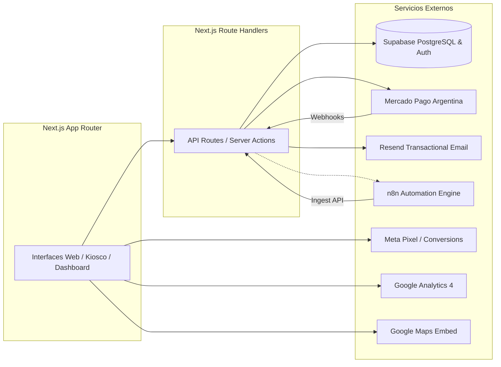

# Integraciones y Servicios Externos

Estado de Verificación: [VERIFICADO]
Fecha de Auditoría: 2026-09-14
Total de Servicios Externos Integrados: 7 plataformas

---

## 1. Mapa General de Integraciones

---

## 2. Detalle de Integraciones

### 2.1. Supabase (Base de Datos & Autenticación)
- **Rol:** Base de datos relacional principal (PostgreSQL 15), motor de autenticación de usuarios y almacenamiento de configuración en tiempo de ejecución (`app_settings`).
- **Conectividad:**
  - Cliente Browser: `@supabase/ssr` (`createBrowserClient`) con `NEXT_PUBLIC_SUPABASE_URL` y `NEXT_PUBLIC_SUPABASE_ANON_KEY`.
  - Cliente Server / API: `@supabase/ssr` (`createServerClient`) con manejo automático de cookies de sesión para Server Components y Route Handlers.
  - Bypass RLS (Servicios internos): Uso controlado de `SUPABASE_SERVICE_ROLE_KEY` en endpoints de ingesta de datos y webhooks.
- **Mecanismos de Sincronización:** Consultas directas vía PostgREST y llamadas RPC (`get_service_role_secret`, `log_audit_event`).

### 2.2. Mercado Pago Argentina (Pasarela de Pagos)
- **Rol:** Procesamiento de pagos con tarjetas de crédito, débito y dinero en cuenta para ventas de la tienda y gift cards.
- **Endpoints Utilizados:**
  - `POST https://api.mercadopago.com/checkout/preferences`: Generación de links de pago (`init_point`).
  - `GET https://api.mercadopago.com/v1/payments/{id}`: Consulta y verificación del estado del pago tras notificación de webhook.
- **Credenciales:** `mp_access_token` y `mp_webhook_secret` leídos dinámicamente desde la tabla `app_settings` en base de datos.
- **Seguridad:** Verificación obligatoria de firma HMAC-SHA256 en cabecera `x-signature`.

### 2.3. Resend (Email Transaccional)
- **Rol:** Despacho de correos electrónicos transaccionales con diseño HTML responsive corporativo.
- **Eventos que Disparan Envíos:**
  - Formulario de Contacto: Notificación al equipo del consultorio y confirmación al paciente.
  - Compra de Tienda: Confirmación de orden y detalle de productos para el comprador.
  - Emisión de Gift Card: Envío del código de regalo (`DL-XXXX-XXXX`) al destinatario.
  - Admisión Kiosco: Notificación interna al staff sobre llegada de paciente a sala de espera.
- **Credenciales:** `resend_api_key` gestionada centralizadamente.

### 2.4. n8n (Motor de Automatización de Procesos)
- **Rol:** Orquestación de flujos de datos asíncronos (ingesta de pacientes, facturación médica, sincronización de campañas de marketing, triggers de tareas operativas).
- **Endpoints de Ingesta Expuestos en Next.js:**
  - `POST /api/ingest/patients`: Ingesta y deduplicación de pacientes por DNI.
  - `POST /api/ingest/payments`: Ingesta de registros de facturación desde sistemas externos.
  - `POST /api/ingest/campaigns`: Ingesta de métricas publicitarias (Meta Ads / Google Ads).
  - `POST /api/blog/ingest`: Publicación automatizada de borradores de artículos médicos.
- **Seguridad:** Header obligatorio `Authorization: Bearer <INGEST_API_KEY>`.

### 2.5. Meta Pixel & Meta Ads
- **Rol:** Medición de conversiones, optimización de campañas de Instagram/Facebook y creación de audiencias personalizadas.
- **Eventos Registrados:** `PageView`, `Contact` (clic en WhatsApp / agendar), `Lead` (formulario de contacto), `AddToCart`, `InitiateCheckout`, `Purchase`.
- **Privacidad y Consentimiento:** Bloqueado por defecto; se activa únicamente tras consentimiento explícito del usuario (`hasMarketingConsent()`).

### 2.6. Google Analytics 4 (GA4)
- **Rol:** Analítica de tráfico web, embudos de conversión, comportamiento de usuarios en páginas de tratamientos y fuentes de adquisición.
- **Eventos Personalizados:** `agendar_consulta_click`, `whatsapp_click`, `add_to_cart`, `begin_checkout`, `gift_card_configure`, `generate_lead`, `purchase`.
- **Privacidad y Consentimiento:** Bloqueado por defecto; se activa únicamente tras consentimiento explícito del usuario (`hasAnalyticsConsent()`).

### 2.7. Google Maps Embed
- **Rol:** Visualización interactiva de la ubicación del consultorio médico (Leandro N. Alem 45, Gualeguaychú, Entre Ríos) en la página `/contacto` y footer.
- **Implementación:** Iframe optimizado con `loading="lazy"` y `referrerpolicy="no-referrer-when-downgrade"`.
