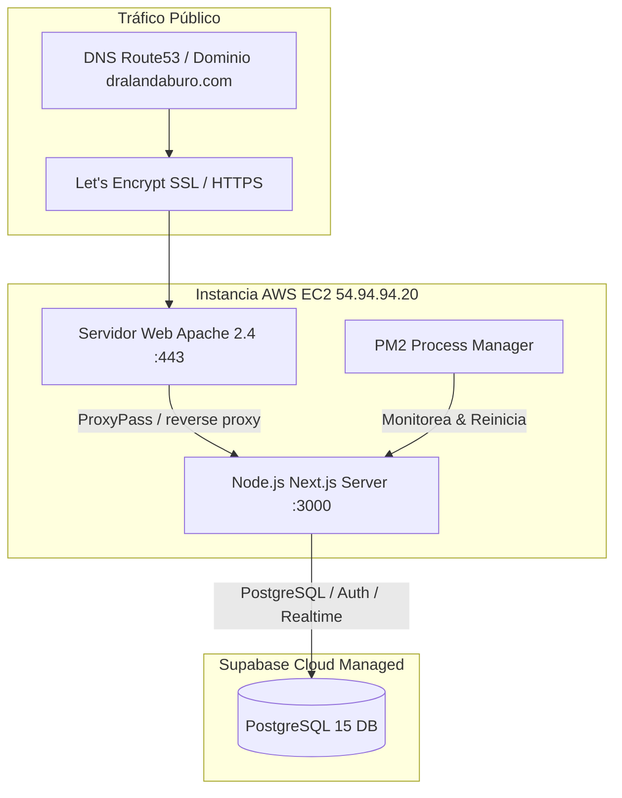
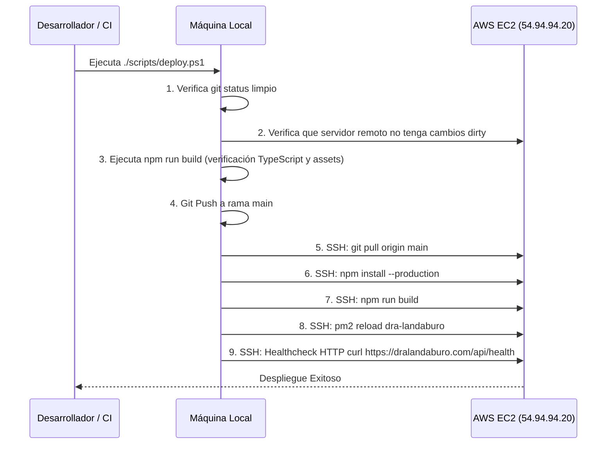

# Infraestructura, Servidores y Despliegue

Estado de Verificación: [VERIFICADO]
Fecha de Auditoría: 2026-09-14
Proveedor Cloud: Amazon Web Services (AWS) EC2
Sistema Operativo: Bitnami Linux (Debian-based)
IP Pública del Servidor: 54.94.94.20
Ruta en Servidor: `/opt/dra-landaburo`

---

## 1. Topología de Infraestructura



---

## 2. Configuración del Servidor y Reverse Proxy

### 2.1. Apache 2.4 Reverse Proxy (`vhost-https.conf`)
Apache actúa como terminador SSL y proxy inverso, redirigiendo todas las peticiones HTTPS entrantes al puerto interno 3000 donde corre Next.js en PM2:

```apache
<VirtualHost *:443>
    ServerName dralandaburo.com
    ServerAlias www.dralandaburo.com

    SSLEngine on
    SSLCertificateFile "/etc/letsencrypt/live/dralandaburo.com/fullchain.pem"
    SSLCertificateKeyFile "/etc/letsencrypt/live/dralandaburo.com/privkey.pem"

    ProxyPreserveHost On
    ProxyPass / http://127.0.0.1:3000/
    ProxyPassReverse / http://127.0.0.1:3000/

    # Compresión gzip/brotli
    AddOutputFilterByType DEFLATE text/html text/plain text/xml text/css text/javascript application/javascript application/json
</VirtualHost>
```

### 2.2. Gestión de Procesos con PM2
- **Nombre de la Aplicación:** `dra-landaburo`
- **Modo:** Fork / Standalone Node.js server
- **Archivo Ejecutable:** `.next/standalone/server.js`
- **Variables de Entorno:** Cargadas desde `.env.local` y runtime systemd.
- **Comandos de Administración:**
  - Ver estado: `pm2 status`
  - Logs en vivo: `pm2 logs dra-landaburo`
  - Reinicio sin caída: `pm2 reload dra-landaburo`

---

## 3. Estrategia de Build Standalone

Next.js está configurado con `output: 'standalone'` en `next.config.js`. Esto empaqueta únicamente las dependencias de producción necesarias en `.next/standalone`, reduciendo el footprint de disco y memoria.

### Script Post-Build (`scripts/copy-standalone-assets.js`)
Debido a que el modo standalone de Next.js no copia por defecto los assets estáticos ni la carpeta pública, se ejecuta automáticamente un script postbuild:
1. Copia `.next/static` a `.next/standalone/.next/static`.
2. Copia `public/` a `.next/standalone/public`.
3. Copia `.env.local` a `.next/standalone/.env.local`.

---

## 4. Pipeline de Despliegue Automatizado (`scripts/deploy.ps1`)

El despliegue a producción está completamente automatizado y controlado mediante el script PowerShell `scripts/deploy.ps1`:


