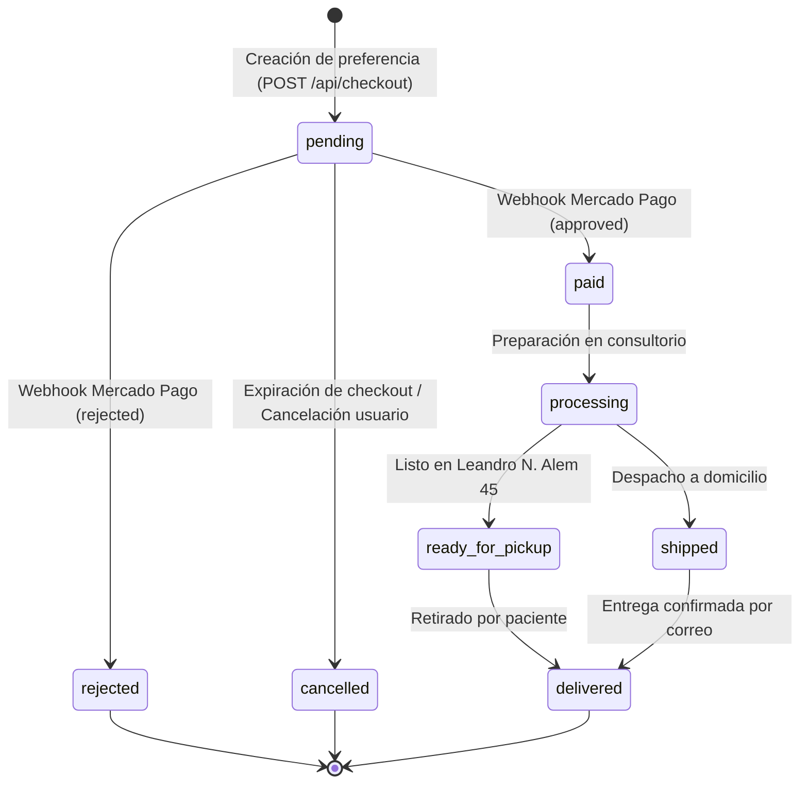
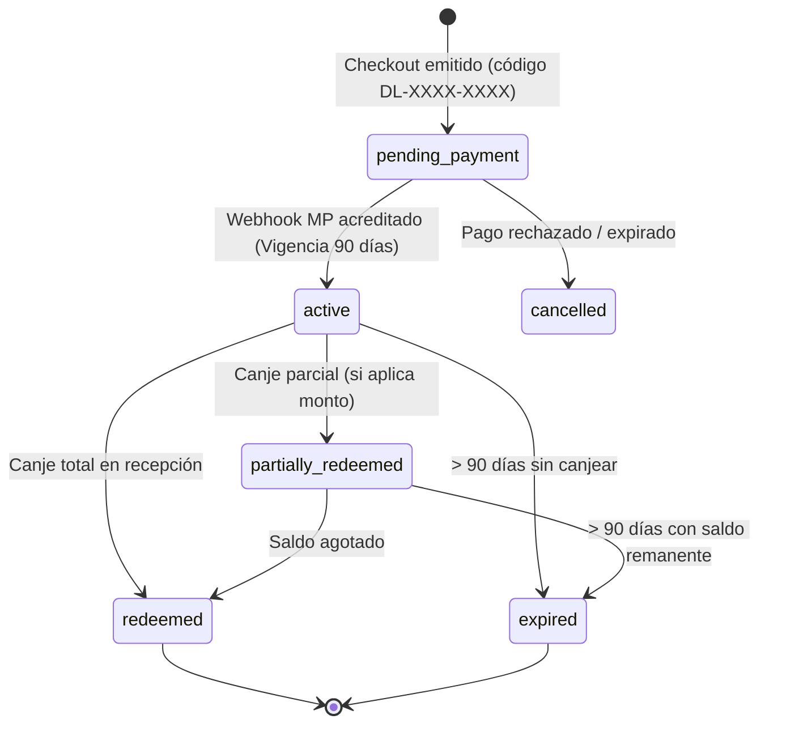
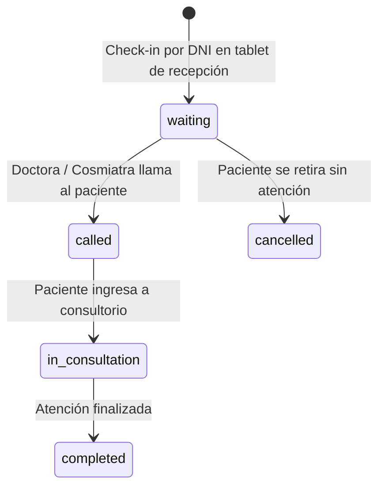
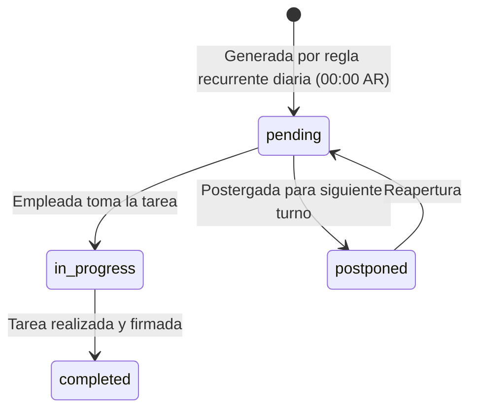

# Modelo de Estados y Manejo de Errores

Estado de Verificación: [VERIFICADO]
Fecha de Auditoría: 2026-09-14
Enfoque: Máquinas de estado finito, códigos de error HTTP y recuperación de fallos

---

## 1. Máquinas de Estado del Sistema

La plataforma gestiona el ciclo de vida de cuatro entidades críticas mediante máquinas de estado deterministas:

### 1.1. Ciclo de Vida de Órdenes de Compra (`orders`)



### 1.2. Ciclo de Vida de Gift Cards (`gift_cards`)



### 1.3. Ciclo de Admisión de Pacientes en Kiosco (`kiosk_admissions`)



### 1.4. Ciclo de Tareas Operativas del Staff (`staff_tasks`)



---

## 2. Catálogo de Errores y Manejo HTTP

Todos los Route Handlers devuelven respuestas de error con formato JSON uniforme:
```json
{
  "error": "DESCRIPCION_HUMANA_DEL_ERROR",
  "code": "CODIGO_INTERNO_OPCIONAL",
  "details": {}
}
```

| Código HTTP | Escenario de Disparo | Manejo en Frontend / Recuperación |
|---|---|---|
| **400 Bad Request** | Parámetros inválidos, DNI mal formado, carrito vacío, monto de gift card menor a mínimo | Toast/Alerta inline en formulario con mensajes específicos |
| **401 Unauthorized** | Token JWT de sesión ausente/expirado, firma HMAC de webhook inválida | Redirección a `/login` o rechazo inmediato de webhook |
| **403 Forbidden** | Usuario autenticado intenta acceder a sección denegada por RBAC | Redirección automática a `/dashboard/sin-acceso` |
| **404 Not Found** | Tratamiento o producto inexistente por slug, Gift Card no encontrada | Renderizado de página 404 personalizada |
| **409 Conflict** | Paciente ya ingresado en admisión hoy, slug duplicado en blog | Mensaje informativo permitiendo actualización de estado |
| **429 Too Many Requests** | Rate limit excedido en lookup de gift cards o consentimiento | Bloqueo temporal con countdown |
| **500 Internal Server Error** | Falla de conexión a Supabase, error no controlado en pasarela | Log estructurado en consola y mensaje amigable al paciente |

---

## 3. Fallbacks y Resiliencia en Renderizado

1. **Catálogo de Tratamientos:** Si la base de datos Supabase no responde o la tabla `treatments` tiene datos parciales, el sistema utiliza el catálogo estático en `src/data/treatments.ts` como fallback garantizando 0 downtime visual.
2. **Imágenes Rotos / Fallbacks:** Las imágenes de productos y tratamientos cuentan con handlers `onError` para mostrar el logo institucional o placeholder neutral.
3. **Consentimiento de Cookies:** Si la API `/api/cookies/consent` falla, el consentimiento se almacena de todas formas en `localStorage` para no interrumpir la navegación del usuario.
