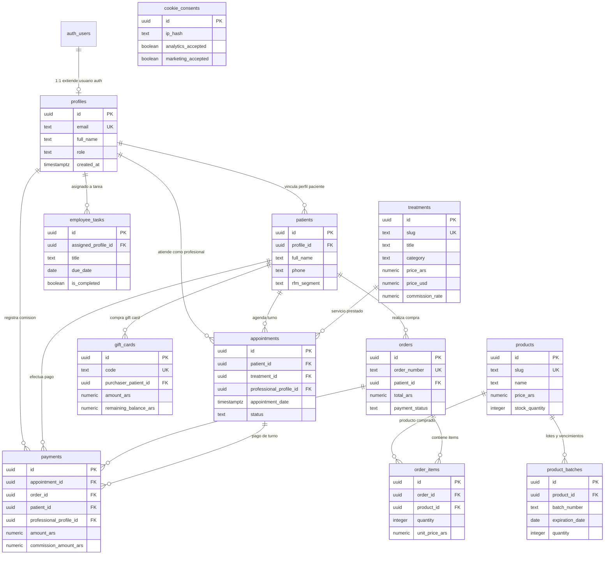

# 📊 Informe de Auditoría y Diseño del Esquema Supabase — Dra. Landaburo

**Proyecto:** Dra. Paula Landaburo — Medicina Estética & Dermatología  
**Instancia Supabase:** `https://mdletvbgwzbpenzevurr.supabase.co`  
**Fecha de Auditoría:** 15 de Agosto de 2026  
**Modo:** Solo Lectura (Sin modificaciones en la base de datos)

---

## 🔍 Resumen del Relevamiento Empírico (Estado Actual)

1. **Consulta Directa:** Se consultaron los endpoints OpenAPI de PostgREST, los servicios administrativos de Supabase Auth (`auth.users`) y el catálogo de Storage utilizando las credenciales del proyecto (`SUPABASE_SERVICE_ROLE_KEY`).
2. **Estado Real de la Instancia:** La base de datos en Supabase se encuentra actualmente en su **estado inicial (0 tablas personalizadas en el esquema `public`, 0 usuarios creados en `auth.users`, 0 buckets de almacenamiento)**.
3. **Integridad:** **No se modificó ni creó ninguna tabla, política ni dato.**

---

## 1. Diagrama Entidad-Relación (Mermaid ER)

*Este bloque en sintaxis Mermaid es compatible con el renderizador nativo de Notion (se renderizará como diagrama gráfico interactivo al pegarlo):*

---

## 2. Detalle Estructurado Tabla por Tabla

### 📄 Tabla `profiles` (Extensión de `auth.users` — Roles RBAC)
Guarda los perfiles y roles de acceso al sistema (Admin, Médico, Operativo, Paciente).

* **Columnas:**
  * `id` (`uuid`, NOT NULL) — **Primary Key**. Apunta a `auth.users.id` (`ON DELETE CASCADE`).
  * `email` (`text`, NOT NULL) — **UNIQUE**.
  * `full_name` (`text`, NOT NULL).
  * `phone` (`text`, NULL, DEFAULT `NULL`).
  * `role` (`text`, NOT NULL, DEFAULT `'paciente'`) — Check constraint: `role IN ('admin', 'medico', 'operativo', 'paciente')`.
  * `created_at` (`timestamptz`, NOT NULL, DEFAULT `now()`).
  * `updated_at` (`timestamptz`, NOT NULL, DEFAULT `now()`).
* **Primary Key:** `id`
* **Foreign Keys:**
  * `id` -> `auth.users(id)` (`ON DELETE CASCADE`)
* **Políticas RLS Activas:**
  * `profiles_select_own_or_admin`: Lectura permitida si `auth.uid() = id` O rol del solicitante es `'admin'`.
  * `profiles_update_own_or_admin`: Modificación permitida si `auth.uid() = id` (campos no sensibles) O rol `'admin'`.
* **Índices Secundarios:**
  * `idx_profiles_role`: ON `profiles(role)`.
  * `idx_profiles_email`: ON `profiles(email)`.

---

### 📄 Tabla `patients` (Ficha Clínica & Registro de Pacientes)
Base unificada de los 800+ pacientes con su segmentación RFM.

* **Columnas:**
  * `id` (`uuid`, NOT NULL, DEFAULT `gen_random_uuid()`) — **Primary Key**.
  * `profile_id` (`uuid`, NULL, DEFAULT `NULL`) — **Foreign Key**.
  * `full_name` (`text`, NOT NULL).
  * `dni` (`text`, NULL, DEFAULT `NULL`) — **UNIQUE**.
  * `phone` (`text`, NOT NULL).
  * `email` (`text`, NULL, DEFAULT `NULL`).
  * `rfm_segment` (`text`, NULL, DEFAULT `'Nuevo'`) — Check: `rfm_segment IN ('Activos', 'En Riesgo', 'No Perder', 'Nuevo', 'Inactivo')`.
  * `notes` (`text`, NULL, DEFAULT `NULL`).
  * `created_at` (`timestamptz`, NOT NULL, DEFAULT `now()`).
* **Primary Key:** `id`
* **Foreign Keys:**
  * `profile_id` -> `profiles(id)` (`ON DELETE SET NULL`)
* **Políticas RLS Activas:**
  * `patients_staff_all`: Lectura y escritura permitida únicamente para perfiles con rol `'admin'`, `'medico'` o `'operativo'`.
  * `patients_patient_read_own`: Lectura permitida al paciente si `auth.uid() = profile_id`.
* **Índices Secundarios:**
  * `idx_patients_phone`: ON `patients(phone)`.
  * `idx_patients_rfm`: ON `patients(rfm_segment)`.

---

### 📄 Tabla `treatments` (Catálogo de 102 Tratamientos)
Catálogo oficial de servicios con comisiones y precios ARS/USD.

* **Columnas:**
  * `id` (`uuid`, NOT NULL, DEFAULT `gen_random_uuid()`) — **Primary Key**.
  * `slug` (`text`, NOT NULL) — **UNIQUE**.
  * `title` (`text`, NOT NULL).
  * `category` (`text`, NOT NULL) — Check: `category IN ('Facial', 'Corporal', 'Capilar', 'Dermatologia Clinica', 'Cosmetologia')`.
  * `description` (`text`, NOT NULL).
  * `price_ars` (`numeric(12,2)`, NULL, DEFAULT `NULL`).
  * `price_usd` (`numeric(12,2)`, NULL, DEFAULT `NULL`).
  * `duration_minutes` (`integer`, NOT NULL, DEFAULT `30`).
  * `professional_role` (`text`, NOT NULL, DEFAULT `'medico'`) — Check: `professional_role IN ('medico', 'cosmetologa')`.
  * `commission_rate` (`numeric(5,2)`, NOT NULL, DEFAULT `0.00`) — Ej: `30.00` para Mercedes en cosmetología.
  * `is_active` (`boolean`, NOT NULL, DEFAULT `true`).
  * `created_at` (`timestamptz`, NOT NULL, DEFAULT `now()`).
* **Primary Key:** `id`
* **Foreign Keys:** Ninguna.
* **Políticas RLS Activas:**
  * `treatments_read_public`: Lectura pública permitida para todos (`anon` y `authenticated`).
  * `treatments_write_admin`: Modificación e inserción restringida a rol `'admin'`.
* **Índices Secundarios:**
  * `idx_treatments_slug`: ON `treatments(slug)`.
  * `idx_treatments_category`: ON `treatments(category)`.

---

### 📄 Tabla `products` (Catálogo de Dermocosmética)
Catálogo de 24 productos de la tienda online con gestión de stock.

* **Columnas:**
  * `id` (`uuid`, NOT NULL, DEFAULT `gen_random_uuid()`) — **Primary Key**.
  * `name` (`text`, NOT NULL).
  * `slug` (`text`, NOT NULL) — **UNIQUE**.
  * `category` (`text`, NOT NULL).
  * `price_ars` (`numeric(12,2)`, NOT NULL).
  * `stock_quantity` (`integer`, NOT NULL, DEFAULT `0`).
  * `min_stock_alert` (`integer`, NOT NULL, DEFAULT `5`).
  * `sku` (`text`, NULL, DEFAULT `NULL`) — **UNIQUE**.
  * `is_active` (`boolean`, NOT NULL, DEFAULT `true`).
  * `created_at` (`timestamptz`, NOT NULL, DEFAULT `now()`).
* **Primary Key:** `id`
* **Foreign Keys:** Ninguna.
* **Políticas RLS Activas:**
  * `products_read_public`: Lectura pública permitida para todos (`anon` y `authenticated`).
  * `products_write_admin`: Escritura restringida a rol `'admin'`.
* **Índices Secundarios:**
  * `idx_products_slug`: ON `products(slug)`.

---

### 📄 Tabla `product_batches` (Control de Lotes y Vencimientos)
Seguimiento de lotes de dermocosmética e inyectables (`[PRODUCTO]: [LOTE]:`).

* **Columnas:**
  * `id` (`uuid`, NOT NULL, DEFAULT `gen_random_uuid()`) — **Primary Key**.
  * `product_id` (`uuid`, NOT NULL) — **Foreign Key**.
  * `batch_number` (`text`, NOT NULL).
  * `expiration_date` (`date`, NOT NULL).
  * `quantity` (`integer`, NOT NULL, DEFAULT `0`).
  * `created_at` (`timestamptz`, NOT NULL, DEFAULT `now()`).
* **Primary Key:** `id`
* **Foreign Keys:**
  * `product_id` -> `products(id)` (`ON DELETE CASCADE`)
* **Políticas RLS Activas:**
  * `batches_admin_only`: Acceso y modificación exclusivo para rol `'admin'`.
* **Índices Secundarios:**
  * `idx_product_batches_expiry`: ON `product_batches(expiration_date)`.

---

### 📄 Tabla `orders` (Compras y Pedidos E-commerce)
Registros de ventas online procesadas por MercadoPago o transferencia.

* **Columnas:**
  * `id` (`uuid`, NOT NULL, DEFAULT `gen_random_uuid()`) — **Primary Key**.
  * `order_number` (`text`, NOT NULL) — **UNIQUE**.
  * `patient_id` (`uuid`, NULL, DEFAULT `NULL`) — **Foreign Key**.
  * `total_ars` (`numeric(12,2)`, NOT NULL).
  * `payment_status` (`text`, NOT NULL, DEFAULT `'pending'`) — Check: `payment_status IN ('pending', 'approved', 'rejected', 'refunded')`.
  * `payment_method` (`text`, NOT NULL) — Check: `payment_method IN ('mercadopago', 'transferencia', 'efectivo')`.
  * `mercadopago_payment_id` (`text`, NULL, DEFAULT `NULL`).
  * `shipping_status` (`text`, NOT NULL, DEFAULT `'pending'`).
  * `created_at` (`timestamptz`, NOT NULL, DEFAULT `now()`).
* **Primary Key:** `id`
* **Foreign Keys:**
  * `patient_id` -> `patients(id)` (`ON DELETE SET NULL`)
* **Políticas RLS Activas:**
  * `orders_read_own`: Pacientes autenticados leen sus propias compras.
  * `orders_admin_all`: Rol `'admin'` tiene lectura/escritura total.
* **Índices Secundarios:**
  * `idx_orders_status`: ON `orders(payment_status)`.

---

### 📄 Tabla `order_items` (Detalle de Productos por Compra)

* **Columnas:**
  * `id` (`uuid`, NOT NULL, DEFAULT `gen_random_uuid()`) — **Primary Key**.
  * `order_id` (`uuid`, NOT NULL) — **Foreign Key**.
  * `product_id` (`uuid`, NOT NULL) — **Foreign Key**.
  * `quantity` (`integer`, NOT NULL, DEFAULT `1`).
  * `unit_price_ars` (`numeric(12,2)`, NOT NULL).
  * `created_at` (`timestamptz`, NOT NULL, DEFAULT `now()`).
* **Primary Key:** `id`
* **Foreign Keys:**
  * `order_id` -> `orders(id)` (`ON DELETE CASCADE`)
  * `product_id` -> `products(id)` (`ON DELETE RESTRICT`)
* **Políticas RLS Activas:** Hereda visibilidad de la orden asociada.

---

### 📄 Tabla `gift_cards` (Tarjetas de Regalo)

* **Columnas:**
  * `id` (`uuid`, NOT NULL, DEFAULT `gen_random_uuid()`) — **Primary Key**.
  * `code` (`text`, NOT NULL) — **UNIQUE**.
  * `purchaser_patient_id` (`uuid`, NULL, DEFAULT `NULL`) — **Foreign Key**.
  * `amount_ars` (`numeric(12,2)`, NOT NULL).
  * `remaining_balance_ars` (`numeric(12,2)`, NOT NULL).
  * `status` (`text`, NOT NULL, DEFAULT `'active'`) — Check: `status IN ('active', 'redeemed', 'expired')`.
  * `expiration_date` (`timestamptz`, NOT NULL).
  * `created_at` (`timestamptz`, NOT NULL, DEFAULT `now()`).
* **Primary Key:** `id`
* **Foreign Keys:**
  * `purchaser_patient_id` -> `patients(id)` (`ON DELETE SET NULL`)
* **Políticas RLS Activas:**
  * `gift_cards_admin_all`: Rol `'admin'` tiene lectura/escritura total.
  * `gift_cards_read_purchaser`: El comprador puede ver sus gift cards activas.

---

### 📄 Tabla `appointments` (Turnos y Citas Médicas)

* **Columnas:**
  * `id` (`uuid`, NOT NULL, DEFAULT `gen_random_uuid()`) — **Primary Key**.
  * `patient_id` (`uuid`, NOT NULL) — **Foreign Key**.
  * `treatment_id` (`uuid`, NOT NULL) — **Foreign Key**.
  * `professional_profile_id` (`uuid`, NULL, DEFAULT `NULL`) — **Foreign Key**.
  * `appointment_date` (`timestamptz`, NOT NULL).
  * `status` (`text`, NOT NULL, DEFAULT `'scheduled'`) — Check: `status IN ('scheduled', 'completed', 'cancelled', 'no_show')`.
  * `notes` (`text`, NULL, DEFAULT `NULL`).
  * `created_at` (`timestamptz`, NOT NULL, DEFAULT `now()`).
* **Primary Key:** `id`
* **Foreign Keys:**
  * `patient_id` -> `patients(id)` (`ON DELETE CASCADE`)
  * `treatment_id` -> `treatments(id)` (`ON DELETE RESTRICT`)
  * `professional_profile_id` -> `profiles(id)` (`ON DELETE SET NULL`)
* **Políticas RLS Activas:**
  * `appointments_staff`: Roles `'admin'`, `'medico'`, `'operativo'` tienen acceso total a la agenda.
  * `appointments_patient_read`: Paciente lee solo sus turnos agendados.
* **Índices Secundarios:**
  * `idx_appointments_date`: ON `appointments(appointment_date)`.

---

### 📄 Tabla `payments` (Registro Financiero & Comisiones)
Base del Dashboard Ejecutivo Financiero (ARS/USD, Transferencia vs. Efectivo, Comisiones).

* **Columnas:**
  * `id` (`uuid`, NOT NULL, DEFAULT `gen_random_uuid()`) — **Primary Key**.
  * `appointment_id` (`uuid`, NULL, DEFAULT `NULL`) — **Foreign Key**.
  * `order_id` (`uuid`, NULL, DEFAULT `NULL`) — **Foreign Key**.
  * `patient_id` (`uuid`, NOT NULL) — **Foreign Key**.
  * `amount_ars` (`numeric(12,2)`, NOT NULL).
  * `amount_usd` (`numeric(12,2)`, NULL, DEFAULT `NULL`).
  * `currency` (`text`, NOT NULL, DEFAULT `'ARS'`) — Check: `currency IN ('ARS', 'USD')`.
  * `payment_method` (`text`, NOT NULL) — Check: `payment_method IN ('efectivo', 'transferencia', 'mercadopago')`.
  * `professional_profile_id` (`uuid`, NOT NULL) — **Foreign Key**.
  * `commission_amount_ars` (`numeric(12,2)`, NOT NULL, DEFAULT `0.00`).
  * `payment_date` (`timestamptz`, NOT NULL, DEFAULT `now()`).
* **Primary Key:** `id`
* **Foreign Keys:**
  * `appointment_id` -> `appointments(id)` (`ON DELETE SET NULL`)
  * `order_id` -> `orders(id)` (`ON DELETE SET NULL`)
  * `patient_id` -> `patients(id)` (`ON DELETE RESTRICT`)
  * `professional_profile_id` -> `profiles(id)` (`ON DELETE RESTRICT`)
* **Políticas RLS Activas:**
  * `payments_admin_all`: Acceso total para rol `'admin'`.
  * `payments_medico_own`: Médicos/cosmetólogas pueden leer sus registros de comisiones.
* **Índices Secundarios:**
  * `idx_payments_date`: ON `payments(payment_date)`.
  * `idx_payments_professional`: ON `payments(professional_profile_id)`.

---

### 📄 Tabla `employee_tasks` (Tareas Operativas del Personal)
Base del Dashboard Operativo (Recontacto Doris, Cumpleaños Ceci, Mystery Shopping Laura).

* **Columnas:**
  * `id` (`uuid`, NOT NULL, DEFAULT `gen_random_uuid()`) — **Primary Key**.
  * `assigned_profile_id` (`uuid`, NOT NULL) — **Foreign Key**.
  * `title` (`text`, NOT NULL).
  * `description` (`text`, NULL, DEFAULT `NULL`).
  * `due_date` (`date`, NOT NULL, DEFAULT `CURRENT_DATE`).
  * `is_completed` (`boolean`, NOT NULL, DEFAULT `false`).
  * `completed_at` (`timestamptz`, NULL, DEFAULT `NULL`).
  * `created_at` (`timestamptz`, NOT NULL, DEFAULT `now()`).
* **Primary Key:** `id`
* **Foreign Keys:**
  * `assigned_profile_id` -> `profiles(id)` (`ON DELETE CASCADE`)
* **Políticas RLS Activas:**
  * `employee_tasks_own`: Empleado lee y marca sus propias tareas.
  * `employee_tasks_admin`: Rol `'admin'` administra todas las tareas.
* **Índices Secundarios:**
  * `idx_employee_tasks_due`: ON `employee_tasks(due_date, is_completed)`.

---

### 📄 Tabla `cookie_consents` (Consentimientos de Privacidad & Analítica)

* **Columnas:**
  * `id` (`uuid`, NOT NULL, DEFAULT `gen_random_uuid()`) — **Primary Key**.
  * `ip_hash` (`text`, NOT NULL).
  * `analytics_accepted` (`boolean`, NOT NULL, DEFAULT `false`).
  * `marketing_accepted` (`boolean`, NOT NULL, DEFAULT `false`).
  * `created_at` (`timestamptz`, NOT NULL, DEFAULT `now()`).
* **Primary Key:** `id`
* **Foreign Keys:** Ninguna.
* **Políticas RLS Activas:**
  * `cookie_consents_insert_public`: Inserción pública (`anon` y `authenticated`).
  * `cookie_consents_select_admin`: Lectura reservada a rol `'admin'`.
